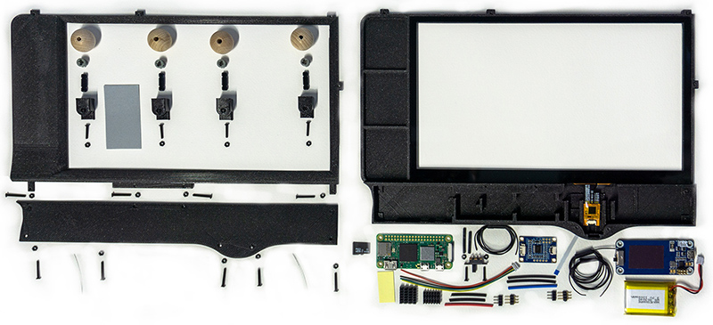

# Welcome to CleAR Sight #

CleAR Sight is an augmented reality research platform based on a touch-enabled, transparent interaction panel. We developed a series of interaction concepts for this platform and demonstrate them in the context of three prototypes, which support the exploration of 3D volumetric data, collaborative visual data analysis, and the control of smart home appliances. More information about our research on CleAR Sight and an in-depth discussion of our concepts & design decisions can be found in our [IEEE ISMAR 2022 paper](https://doi.org/10.1109/ISMAR55827.2022.00034) or on our [project page](https://imld.de/clear-sight).

This software is being developed for research use. It may contain bugs, including critical security flaws.
Do not use this software for mission-critical purposes and only use it in closed, trusted networks.
In accordance with the license terms, no warranty of any kind is given.

## Installation ##

1. Check the prerequisites:
   * A transparent interaction panel, see below
   * An OptiTrack IR tracking system compatible with the [MotiveDirect](https://github.com/XmanLCH/MotiveDirect) tracking plugin for Unity
   * A set of combined IR/QR-Code markers
2. Check out the repository
3. Open project in Unity 2020.3.x
4. Check the network settings in the Motive Direct component of the TrackingSystem game object or prefab
5. Run from Unity using remote rendering to a HoloLens device

If you find any bugs or would like to see additional features, please create a ticket in the issue tracker. For general feedback, contact the authors at firstname.lastname AT tu-dresden.de. Please understand that we do not have the resources to provide general support for this software.

## Transparent Interaction Panel ##



### Hardware ###
- Please refer to the [building instructions](https://imld.de/docs/projects/clear-sight/clear-sight-building-instructions.pdf).
- The STL file for the case can be found [here](https://imld.de/docs/projects/clear-sight/clear-sight-3d-models.zip)
- To boot the interaction panel, put the switch in the *on* position
- The safest option to turn it off is to issue the `sudo shutdown now` command locally or over SSH. The device can also be switched off by putting the switch in the *off* position.
- In any case, the switch should be turned off after shutting down the system.
- The internal battery can be charged by connecting a standard charger via micro USB to the USB port of the battery.

>>>
:warning: **Warning:** Never plug a USB charger into the regular USB (data) port! Never plug a USB charger into the RaspberryPi USB (power) socket when the battery is connected! Only charge the device via the battery USB socket.
>>>

### Touch Listener ###

1. Make sure that you have correctly installed Raspberry Pi OS on the interaction panel.
2. Copy the files in the [touch listener repository](https://github.com/imldresden/CleAR-Sight-TouchListener) to the device, e.g., using git or scp:

   ````console
   $ scp .\prototype-transparent-tablet\touch-raspberry\* pi@xxx.xxx.xxx.xxx:~/touch-server/
   ````

3. Compile _touchlistener.c_:

   ````console
   $ gcc -o touchlistener touchlistener.c
   ````
4. Use chmod to make _server.sh_ executable if it isn't.
6. Edit _server.sh_ as needed, changing device name or IP address. Make sure the file has correct Unix style line endings!
7. Add _server.sh_ to autostart:

   ````console
   $ sudo crontab -e
   ````

   Add the following lines:
   
   ````
   # automatically starts the server a few seconds after reboot
   @reboot /bin/sleep 30 ; "/home/pi/touch-server/server.sh"
   # switches power saving off for Wifi
   @reboot /sbin/iwconfig wlan0 power off
   ````

### Problem Solving ###
If no touch is transmitted, try the following:
1. Make sure that the device is powered on. The green LED should light up. If the battery is empty, the device may not turn on even if a charging cable is connected. Let it charge for a few minutes and then try again.
2. Check that *all* devices are in the same network and ideally connected to the same router. Touch events are sent via UDP broadcast and this traffic may not cross between network segments.
3. Make sure that firewall settings in the network or on the devices do not interfere with the operation.
4. Use `top` to check if the _server.sh_ script, and the _touchlistener_ and _netcat_ processes are running on the RaspberryPi. They should start automatically but might fail to start in rare circumstances.
5. Make sure that the _touchlistener_ configuration is correct. Check _server.sh_ for the options.

- To connect to the device via SSH: `ssh pi@xxx.xxx.xxx.xxx` with its current IP.
- To check the current wifi configuration, use `ifconfig`
- For changing the basic Raspberry Pi OS configuration (Wifi, SSH, ...) use the configuration tool: `sudo raspi-config`
- To log in locally, use a paired BT keyboard and connect a display to the HDMI port.

## Citing CleAR Sight ##

If you would like to reference CleAR Sight in your research, please cite our ISMAR ’22 paper:

_Katja Krug*, Wolfgang Büschel*, Konstantin Klamka, and Raimund Dachselt. CleAR Sight: Exploring the Potential of Interacting with Transparent Tablets in Augmented Reality. In Proceedings of the 21st IEEE International Symposium on Mixed and Augmented Reality (ISMAR ’22), 2022, Singapore. IEEE. https://doi.org/10.1109/ISMAR55827.2022.00034_

_*) Authors contributed equally to this project_


## License notice ##

Copyright (c) Interactive Media Lab Dresden, Technische Universität Dresden.

MIT License

Permission is hereby granted, free of charge, to any person obtaining a copy of this software and associated documentation files (the "Software"), to deal in the Software without restriction, including without limitation the rights to use, copy, modify, merge, publish, distribute, sublicense, and/or sell copies of the Software, and to permit persons to whom the Software is furnished to do so, subject to the following conditions:

The above copyright notice and this permission notice shall be included in all copies or substantial portions of the Software.

THE SOFTWARE IS PROVIDED AS IS, WITHOUT WARRANTY OF ANY KIND, EXPRESS OR IMPLIED, INCLUDING BUT NOT LIMITED TO THE WARRANTIES OF MERCHANTABILITY, FITNESS FOR A PARTICULAR PURPOSE AND NONINFRINGEMENT. IN NO EVENT SHALL THE AUTHORS OR COPYRIGHT HOLDERS BE LIABLE FOR ANY CLAIM, DAMAGES OR OTHER LIABILITY, WHETHER IN AN ACTION OF CONTRACT, TORT OR OTHERWISE, ARISING FROM, OUT OF OR IN CONNECTION WITH THE SOFTWARE OR THE USE OR OTHER DEALINGS IN THE SOFTWARE.